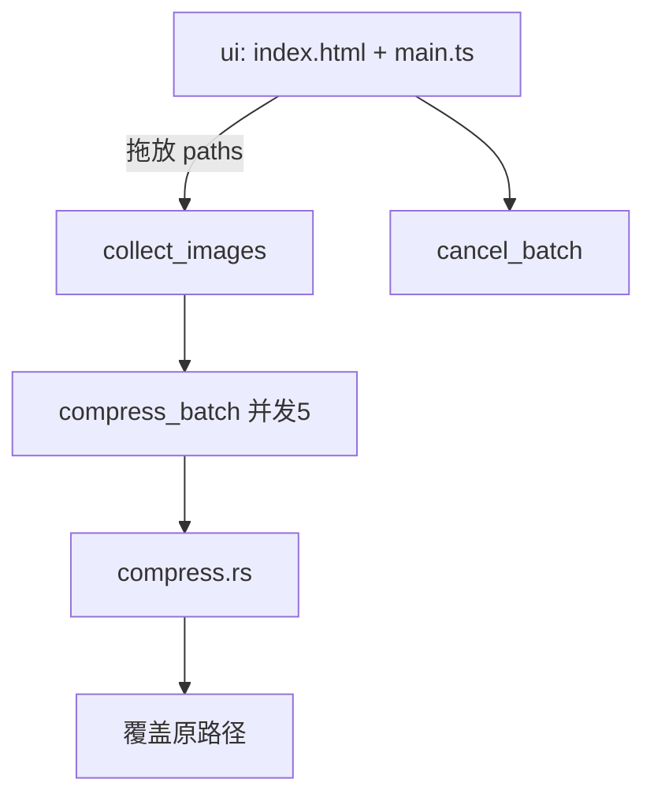

# 《TinyImage 技术实施白皮书》

**文档版本**：v1.35.0（**T037**：图钉置顶 · 产品 **2.1.3**）  
**编制日期**：2026-08-23  
**仓库**：[https://github.com/XiaoKe225/tinyImage](https://github.com/XiaoKe225/tinyImage)  
**决策依据（已拍板）**：

| 包 | 题号 | 选择 | 含义 |
|---|---|---|---|
| T001～T036 | （既有） | — | 发版/打赏/Pack 等已落盘 |
| **T037** | **包主题：图钉置顶** | **alwaysOnTop** | **主界面图钉切换窗口置顶并本机记住；结果入册并升版白皮书；产品 2.1.3** |

> **本版**：拖图时窗口可固定最前；压缩管线不变。  

---

## 文档修订记录

| 版本 | 日期 | 修订内容 |
|---|---|---|
| **v1.35.0** | **2026-08-23** | **T037：图钉置顶（alwaysOnTop + 持久化）** |
| v1.34.0 | 2026-08-21 | T036：整理仓库、文档框架、提交上传并发布 2.1.2 |
| v1.33.0 | 2026-08-21 | T035：Pack 前端混淆 + protected 目录；产品 2.1.2；授权打包执行 |
| v1.32.0 | 2026-08-21 | T034：启动屏外坐标→居中并聚焦 |
| v1.31.0 | 2026-08-21 | T033：产品 README + 默认最小窗 + 打赏无白滚动条 |
| v1.30.0 | 2026-08-21 | T032：打赏支持（本地收款码）；产品 2.1.1 |
| v1.29.0 | 2026-08-21 | T031：仓库整理（删冗余、更新 README/gitignore、提交） |
| v1.28.2 | 2026-08-21 | T004：用户手测 A2/A4/A5/A6 通过；安装验收结案 |
| v1.28.1 | 2026-08-21 | T004：授权打包（含 T030）；更新 A1/A3 |
| v1.28.0 | 2026-08-21 | T030：ICO 保真区量化→RGBA，修力度18只省4K |
| v1.27.0 | 2026-08-21 | T029：其他格式体积极致×速度（单次高努力+早停） |
| v1.26.0 | 2026-08-21 | T028：其他格式压缩速度（砍 Zopfli/m6/色阶穷举） |
| v1.25.0 | 2026-08-21 | T027：WebP/GIF/BMP/TIFF/ICO 保真体积极致 |
| v1.24.0 | 2026-08-21 | T026：禁索引色 PNG-in-ICO（修压后损坏） |
| v1.20.0 | 2026-08-21 | T023：力度与窗口设置本机持久化 |
| v1.17.0 | 2026-08-21 | T020：0档高质优先 first-fit；禁低q |
| v1.16.0 | 2026-08-20 | T019：修 PSNR 假门禁；bpp 门禁；观感须明显压过无损 |
| v1.15.0 | 2026-08-20 | T018：停强制 progressive；0档 Jpegli 观感体积+锐度四门禁 |
| v1.14.0 | 2026-08-20 | T017 像素无损熵优化 |
| v1.4.0 | 2026-08-20 | T007 Jpegli C |
| v1.2.0 | 2026-08-20 | T005 拍板；T005a 近无损引擎 |
| v1.1.2 | 2026-08-20 | T004 NSIS |
| v1.1.1 | 2026-08-20 | T003 队列 |
| v1.1.0 | 2026-08-20 | Tauri+纯本地 |
| v1.0.0 | 2026-08-20 | Electron 历史稿 |

---

## 1. 产品定位（v1.1）

| 项 | 口径 |
|---|---|
| 形态 | Tauri 2 桌面应用（Windows NSIS；macOS 后续） |
| 核心能力 | 拖前调强度 → 拖放 JPG/PNG/WebP/GIF/BMP/TIFF/ICO → **本机 Rust 单次极限编码** → confirm 后覆盖原文件 |
| 网络 | **压缩不需要网络**；无第三方压缩 API、无额度 |
| 版本号 | 产品线 **2.1.3**（与旧 Electron 1.2.x 区分） |
| 置顶 | 主界面「图钉置顶」→ `alwaysOnTop`；状态本机记住 |
| 打赏 | 主界面入口；**仅本地展示**收款码图，不发起支付 API、不上传任何数据 |
| Pack | Dev 不混淆；**加壳发布**必前端 JS 混淆 → NSIS → `release\protected\`；禁原生壳 |
| 旧版 | `legacy-electron/` 仅对照，不演进功能 |

### 1.1 明确废止

- TinyPNG / `tinypng.com` HTTP 压缩路径  
- focusbe 远程 iframe / `remote-render.js`  
- Electron + imagemin + tinypngjs 主线  
- 伪造 `X-Forwarded-For` 绕过限额  

---

## 2. 技术栈

| 层 | 技术 | 用途 |
|---|---|---|
| 壳 | Tauri 2 | 窗口、拖放、IPC |
| 压缩 | **Jpegli C** + MozJPEG 回退 + oxipng + imagequant + **libwebp / gif** | 纯本地多格式 |
| 前端 | Vite + TypeScript + 原生 DOM | 强度滑条 / 拖放 / 进度 |
| 打包 | `tauri build` → NSIS | T004 |

开发命令：

```bash
npm install
npm run start          # tauri dev
npm run test:rust      # cargo test（压缩单元测）
npm run tauri build    # 需「授权 release / 打包」后执行发布向构建
```

---

## 3. 架构



| 模块 | 路径 | 职责 |
|---|---|---|
| 压缩引擎 | `src-tauri/src/compress.rs` + `formats_extra.rs` | JPG/PNG + WebP/GIF/BMP/TIFF/ICO |
| 批量队列 | `src-tauri/src/queue.rs` | 收集、并发 5、**120s** 超时、取消、进度事件 |
| 命令入口 | `src-tauri/src/lib.rs` | `collect_images` / `compress_batch` / `cancel_batch` / `compress_image` |
| 前端 | `src/main.ts` | 拖放、confirm、进度、取消、失败列表、复制路径 |
| 旧 Electron | `legacy-electron/` | 历史对照 |

---

## 4. 压缩策略（冻结 · v1.29 / T030～T031）

| 格式 | 算法 | 写回规则 |
|---|---|---|
| `.jpg` / `.jpeg` | **全程 Jpegli 优先**；0：q92→86 first-fit（达标可跳过无损）；1–24：有损/无损取小；≥25：420+少次降q精炼 | SSIM/HF |
| `.png` | 轻量 oxipng；必要时 pngquant（禁重 Zopfli 默认路径） | SSIM/HF |
| `.webp` | **m4 探路**（无损/近无损/短有损）→ **赢家一次 m6 抛光** | 同扩展名；过门禁取最小 |
| `.gif` | **短色阶无抖动取最小**；仅仍≥90% 才轻度抖动；70% 早停 | 同扩展名；过 SSIM 取最小 |
| `.bmp` | **短色阶索引/RLE 走完**（禁首档即停） | 同扩展名；过门禁取最小 |
| `.tif` / `.tiff` | **Deflate Balanced / LZW / Packbits**（禁 Best） | 同扩展名；过门禁取最小 |
| `.ico` | **量化→RGBA 真彩 PNG-in-ICO**（优先）+ oxipng 回退；**禁索引色**；≥25 可缩边 | 同扩展名；GDI+ 可开 |

| 项 | 口径 |
|---|---|
| 确认 UI | 应用内 modal |
| 默认力度 | **0** |
| **窗口** | **默认 = 最小 360×360**；大小不持久化；位置可记住；**启动时校验可见，屏外则居中** |
| UI 文案 | 面向用户；禁「学坎」等黑话 |
| 设置持久化 | **力度 + 窗口位置**；**不含窗口大小** |
| 单任务超时 | **120s** |

### 4.1 T005 / T006 阶段验收（禁止未达标结案）

| 子包 | 范围 | 通过标准 | 状态 |
|---|---|---|---|
| **T005a** | JPG/PNG 近无损（历史阶梯） | 已被 **T006** 取代写回策略 | **策略被 T006 覆盖** |
| **T006** | 滑条 + 单次极限编码 JPG/PNG | 单测通过；手测可调强度、体积随强度变小 | **已被 T009 修正** |
| **T009** | 修滑条无效 / 原图压不动 | 单测通过 | **已实现** |
| **T010** | 低档 q95+444 | 导致 0 档几乎不压 | **已被 T011 废止** |
| **T011** | 近无损大力压缩重构 | 强度0明显压小 | **已实现（细部策略由 T012 修正）** |
| **T012** | 0 档保细颗粒 | HF 门禁 + 低档 444 | **已实现** |
| **T013** | 体积压到极致 | 双编码器/精炼能力 | **已实现（默认点由 T014 回调至75%）** |
| **T014** | 推0失真 + 对齐学坎质量% | 0=q92+444；默认75% | **已实现（由 T015 强化）** |
| **T015** | 推0仍失真且体积几乎不变 | strip-meta + q96阶梯+禁420 | **已实现（由 T016 加速）** |
| **T016** | 弹窗裁切+太慢+默认0 | 自绘modal；短阶梯 | **已实现** |
| **T017** | 0档细部仍失真且体积小 | 像素无损熵优化 | **已实现（由 T018 修正 progressive 发软）** |
| **T018** | 0档仍糊+体积仍小 | 停强制progressive；Jpegli观感+四门禁；连续自测5次 | **已实现（由 T019 修真根因）** |
| **T019** | 力度0仍糊且体积几乎不降 | 修PSNR假门禁；解无损锁死；bpp门禁；连续自测20次 | **已实现（由 T020 修正贪体积发糊）** |
| **T020** | 力度0仍糊+体积几乎不降 | 高质优先 first-fit；禁≤q82；5逻辑自测 | **已实现（由 T021 修滑条）** |
| **T021** | 0档+调力度几乎不压 | 破保真区锁死；降q恢复；极档HF；10维+5逻辑 | **已实现** |
| **T022** | 太慢；窗口；去学坎黑话 | Jpegli单路加速；窗口360；用户文案；5逻辑 | **已实现** |
| **T023** | 打开不重调；窗口大小不持久化 | 力度+位置记住；大小每次默认360 | **已实现** |
| **T005b** | WebP/GIF/BMP/TIFF/ICO | 见 §4.2；同扩展名；连续工具自测×5 | **已实现（由 T024 修小文件）** |
| **T024** | 部分格式小文件无法压缩 | BMP索引/RLE；TIFF Deflate；GIF quant；WebP阶梯；ICO量化缩边；工具×5 | **已实现（由 T025 修 ICO 假门禁）** |
| **T025** | 用户 ICO 仍跳过（力度18） | 内嵌 PNG oxipng/量化；合成 SSIM；禁裸丢 alpha；用户样本工具验证 | **已实现（由 T026 禁损坏索引色）** |
| **T026** | 部分格式压后损坏 | 禁 ICO 索引 PNG；Windows GDI+ 可开；连续工具×5 | **已实现** |
| **T027** | 其他格式无损+体积极致 | WebP 努力度/近无损；GIF/BMP 色阶竞小；ICO Zopfli；工具断言 | **已实现（由 T028 加速）** |
| **T028** | 其他格式压缩太慢 | 砍 Zopfli/m6/色阶×抖动穷举；TIFF 禁 Best；工具时钟预算×5 | **已实现（由 T029 补体积）** |
| **T029** | 体积极致×仍太慢 | m4 探路+赢家 m6 抛光；GIF 色阶走完；ICO preset5 单次；体积地板+时钟×5 | **已实现（由 T030 修 ICO 保真区）** |
| **T030** | 力度18只省4K | ICO 量化→RGBA（禁索引）；&lt;55% 地板；不慢于旧 oxipng；工具×5 | **已实现（已打入 NSIS）** |
| **T031** | 整理仓库并提交 | 删 t0* 转储/tools 脚本/旧 exe；README·gitignore；commit 不 push | **本版实现** |

### 4.2 T005b 策略冻结（v1.2.1）

| 项 | 口径 |
|---|---|
| WebP | 无损优先 → 近无损 + **SSIM≥0.985** |
| GIF | gifsicle 级优化（同后缀） |
| BMP / TIFF / ICO | 见 §4 表；**禁止**仅做无压缩恒等重编码 |
| 动手门禁 | **已过**：用户当条 **Q1=A，Q2=A，Q3=A**（等同继续 T005b + 升版） |
| 结案 | 工具实测 `npm run test:rust` **连续 5 次 exit 0**；未宣称前不得假结案 |

### 4.3 T024 / T025 小文件真根因

| 判定 | 说法 | 结论 |
|---|---|---|
| 假 | 门禁过严导致无法压 | 用户 ICO oxipng 已缩 84k→70k，却被假 SSIM 杀掉 |
| 假 | 文件已极压 | 工具显示量化后可至 ~30% |
| 真 | 旧路径 RGB 丢 alpha 再编码 | 打不过已优化 PNG-in-ICO |
| 真 | `rgba_to_rgb` 丢弃 alpha 且保留透明区脏 RGB | oxipng optimize_alpha 后裸 SSIM≈0.73 |
| 真 | 写出 **索引色 PNG-in-ICO (IHDR colorType=3)** | Windows GDI+ 报「内存不足」实为拒载损坏 | 仅允许 colorType 2/6；删 qpng 路径 |

| 假根因 | 真根因 | 对策 |
|---|---|---|
| 门禁过严 | BMP 24bit 恒等重编码 | 索引8 + RLE8 |
| 门禁过严 | TIFF 默认无压缩 | Deflate/LZW/Packbits |
| 门禁过严 | GIF 仅复写帧 | imagequant 再编码 |
| 已极压 | WebP 单点 q | 质量阶梯取最小过门禁 |
| ICO 无法压 | 假 SSIM（丢 alpha）+ 无载荷 oxipng | T025 合成门禁 + 内嵌 PNG 优化 |
| **压后损坏** | **索引色 PNG-in-ICO** | **T026：禁 colorType=3；oxipng 禁降色** |
| **其他格式太慢** | **Zopfli / m6 多遍 / 色阶×抖动穷举** | **T028 砍穷举；T029 改单次抛光** |
| **体积不够极致（T028 后）** | **过早早停 / 首档即停 / 双 preset 不如单 preset5** | **T029：走完短色阶；赢家 m6；ICO preset5** |
| **力度18只省约4K** | **保真区 ICO 仅 oxipng 已优化 PNG** | **T030：量化后扩 RGBA 真彩（仍禁 colorType=3）** |

### 4.4 T027 真假根因

| 判定 | 说法 | 结论 |
|---|---|---|
| 假 | 再放松 SSIM 才能更小 | 门禁已够；再松会糊 |
| 假 | 换扩展名才能极致 | 已拍板同扩展名写回 |
| 真 | WebP `encode_lossless` 固定 quality=75 | libwebp 无损下 quality=努力度 |
| 真 | GIF/BMP 单色阶 | 多色阶竞小过门禁 |
| 真 | ICO 仅轻量 oxipng | 努力度不足（Zopfli 过慢，改 preset5） |

### 4.5 T028 / T029 真假根因（速度×体积）

| 判定 | 说法 | 结论 |
|---|---|---|
| 假 | 再开线程就能快 | 单文件仍受编码器串行成本支配 |
| 假 | 放松 SSIM / 换扩展名 | 与已拍板冲突；非慢因/非体积因 |
| 假 | 保真区一上来就 m6 无损 | 对已有损 WebP 白烧 CPU（工具：5.5s） |
| 真 | m6×密阶梯 / Zopfli 穷举 | 慢；改为探路+一次抛光 |
| 真 | GIF 85% 过早返回 / 色阶过短 | 体积停在 ~95%；改为走完短色阶、70% 早停 |
| 真 | BMP 256 色首档即 break | 丢掉更小索引档 |
| 真 | ICO preset3+4 双跑 | 慢且体积不如单次 preset5 |

### 4.6 T030 真假根因（力度18 只省 4K）

| 判定 | 说法 | 结论 |
|---|---|---|
| 假 | 力度滑条坏了 / UI 没生效 | 工具：i18 确走 `oxipng-payload`，省 ~3.7KB |
| 假 | 再开索引色 PNG-in-ICO | T026：GDI+ 拒载（「内存不足」） |
| 假 | 再开线程 / 松 SSIM | 非体积根因 |
| 真 | 保真区（i&lt;25）禁止缩边，只剩 oxipng | 已优化 PNG-in-ICO 几乎压不动 |
| 真 | 缺少「减色但仍 RGBA」路径 | 量化→扩 RGBA（colorType=6）工具：95.6%→42.1%，更快 |

---

## 5. 阶段计划

| 阶段 | 主题 | 验收要点 |
|---|---|---|
| T002 | Tauri 骨架 + 单张 | 已结案 |
| T003 | 并发 5 + 取消 + 失败列表 + 文件夹 ≤300 | 已结案 |
| T004 | Windows NSIS | **A1～A6 已全部通过（结案）** |
| T005a | JPG/PNG 近无损（阶梯） | 已被 T006 覆盖 |
| **T007** | Jpegli C 主 JPG | **本版交付；对照 MozJPEG 手测** |
| T005b | 多格式 | **本版已实现**（Q1=A/Q2=A/Q3=A） |

### 5.1 T003 行为冻结

| 项 | 口径 |
|---|---|
| 并发 | **5**（`DEFAULT_CONCURRENCY`） |
| 单任务超时 | **120s** |
| 批量上限 | **300** 张 |
| 取消 | `cancel_batch` → 未开始任务标「已取消」；已开始的跑完再汇总 |
| 失败 UX | 列表展示 path+error；「复制失败路径」 |
| 进度事件 | `compress-progress` |

### 5.2 T004 打包冻结

| 项 | 口径 |
|---|---|
| 目标 | Windows **NSIS** 安装包（`bundle.targets: ["nsis"]`） |
| 自动更新 | **本阶段不做** |
| 授权词 | 用户当条明示 **「授权打包」**（或「授权 release」）后，助手才可执行 `npm run tauri build` |
| 不等于授权 | 「提交」「继续」「Qn=」「升版白皮书」「结案」 |
| 产物路径 | `src-tauri/target/release/bundle/nsis/`（以实际生成为准） |
| 版本 | 产品 **2.1.3**（当前）；T004 结案时产物为 **2.1.0** |

### 5.3 T004 验收表（安装包产出后填写）

| 编号 | 步骤 | 通过标准 | 实际结果 |
|---|---|---|---|
| A1 | `npm run test:rust` | 全部通过 | ✅ 2026-08-21 打包前：42 passed / 1 ignored / exit 0 |
| A2 | `npm run start` 拖 1 张 JPG+PNG | 可压、busy 释放 | ✅ 用户书面：过 |
| A3 | 用户「授权打包」后 `npm run tauri build` | NSIS 安装包生成 | ✅ `TinyImage_2.1.0_x64-setup.exe`（2026-08-21 13:18，~2.95MB，含 T030） |
| A4 | 安装包安装到本机 | 可启动 TinyImage | ✅ 用户书面：过 |
| A5 | 安装版断网压图 | 成功或明确失败，不卡死 | ✅ 用户书面：过 |
| A6 | 确认无 focusbe/TinyPNG 远程脚本 | DevTools/网络无第三方压缩请求 | ✅ 用户书面：过 |

---

## 6. 非功能需求

| 项 | 要求 |
|---|---|
| 离线 | 压缩路径零网络 |
| 安全 | CSP 默认 self；无远程脚本；用户图片不上云 |
| 超时 | 单文件 **120s** |
| 性能 | 默认并发 **5** |
| 分发 | NSIS；无代码签名（本阶段）；无自动更新 |

---

## 7. 测试

| 级 | 内容 |
|---|---|
| 单元 | compress + `collect_images` |
| 手测 | H1～H5（开发态）；A1～A6（安装包） |

---

## 8. 已知风险

| 编号 | 风险 | 缓解 |
|---|---|---|
| R1 | 有损 JPEG 可能损失质量 | q=80 可配置化放后续包 |
| R2 | 已高度优化的 PNG 可能 skipped | 计入「跳过」 |
| R3 | Windows 需 WebView2 | 系统自带或引导安装 |
| R4 | 取消时已在跑的任务仍会写完 | 文档明示 |
| R5 | 未签名安装包 SmartScreen 警告 | 本阶段接受；签名另包 |

---

**文档结束** · T004 / T031～**T037（图钉置顶 · 2.1.3）** 已入册。Pack 须「授权打包」；git 须「提交」/「上传」。
